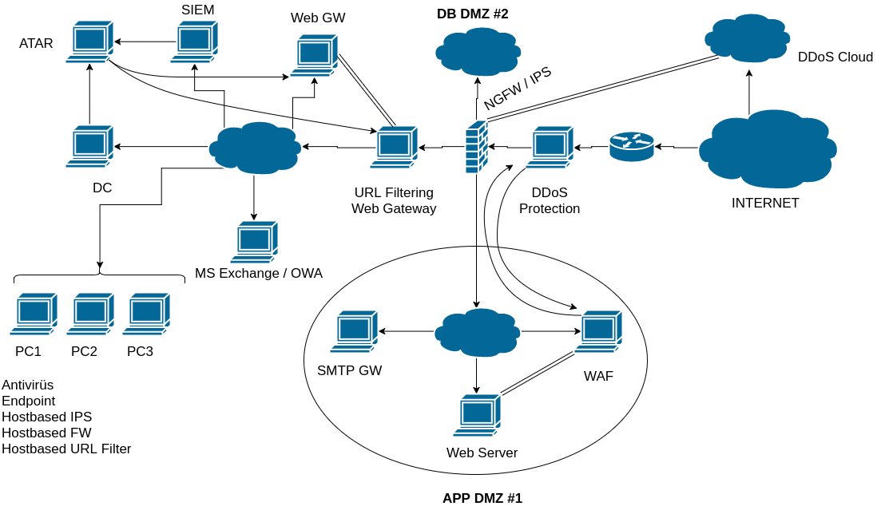
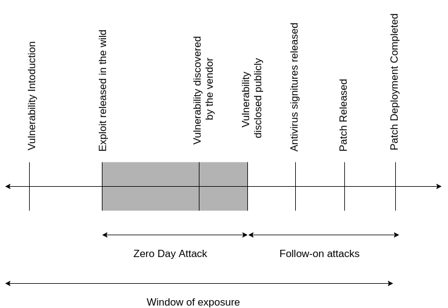
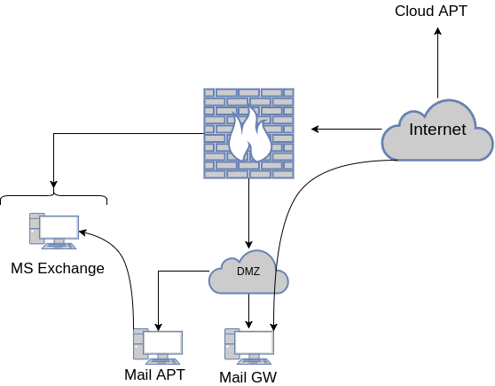

# CDSC Notları
---

---

# İçindekiler
- [Defensive](#defensive)
    - [Ağ Mimarileri](#ag-mimarileri)
- [Offansive](#offensive)

# Defensive
## Ağ mimarileri

**Gopher:** Bir index sayfası şeklinde açılan ve ağaç üzerinde çalışılan sistem.

**ARPA:** Advanced Request Project Agency

### Katmanlar arası iletişim
```
               |Başlık|........|CRC|
        |Başlık|        ...        |CRC|
 |Başlık|               ...            |CRC|
```

---

- **Ethernet:**
    - MAC protokolü kullanır.
    - CSMA/CD (Carrier Sense Multiple Access Collision Detection) Ortam erişim denetimi kullanır.
    - **Preamble:** 7 byte, Çerçeve ayracı (frame delimiter) : 1 byte
    - **Hedef adres:** Alıcının 48 bitlik MAC adresi
    - **Kaynak adres:** Göndericinin 48 bitlik MAC adresi
    - Çerçeve türü: 2 byte
    - Veri
        - En az 46 byte
        - En fazla 1500 byte
    - 4 byte CRC (Cyclic Redundancy Check) veri bütünlüğü kontrolü yapılır.

tür | açıklama
----|---------
0800|IP veri bloğu
0806|ARP(28 byte) + Dolgu
0808|RARP (28 byte) + Dolgu

**/etc/protocols**: Kullanılabilecek tüm protokollerin bulunduğu dosya.

---

- **Switch**
    - HUB ın daha gelişmiş versiyonudur.
    - Hangi ucunda hangi MAC adresli istemci bulunduğuna dair bir tablo tutar.
    - Kendisine gelen bir çerçevenin hedef adrsine bakarak ilgili uca gönderir.
    - Eğer hangi uca gideceği bilinmiyorsa hepsine gönderir.
    - Uzaktan yönetilebilir.
- **Repeater**
    - Uzak mesafeli iletişim için kendisine gelen fiziksel sinyaller güçendirerek diğer ağ parçasına yollar.
- **Köprü**
    - İki farklı ağ yapısını birbirine bağlamak için kullanılır. (Örneğin Ethernet veya Token ring)
- **Güvenlik Duvarı (Firewall)**
    - OSI nin 2 ve daha yukarı katmanlarında çalışır.
    - Üzerinden geçen trafiği kontrol eder.
    - Belirlenen politika uyarınca yazılacak olan kurallara göre üzerinden trafiğin geçisini engelleyebilir/müsade edebilir.
- **Sanal ağlar (VLAN)**
    - 802.1q standardına sahiptir.
    - Switch i mantıksal olarak ayrı switchlere bölmemizi sağlar. (Örneğin switche 0..3 portu 4..5 portu ile iletişim kuramasın diyebiliriz.)
- **Özel Sanal Ağ (VPN)**
    - İnternet üzerinde iletişimde bulunan iki noktanın şifreli olarak birbirleri ile görüşmeleridir.

**TCP/IP Katmanları**

 4|Uygulama katmanı
---|---
3|İletim katmanı (TCP)
2|Ağ katanı (IP)
1|Ağ erişim katmanı (MAC)

---

`ifconfig eth0 mtu 1490` komutu gönderilecek maksimum veri boyutunu 1490 olarak değiştirmemizi sağlar. Bu değeri düşürürsek sıkıntı olmaz fakat yükseltirsek 1500 ile alan alıcılar için sıkıntı olacaktır.

---

Diyelim bilişim güvenliği departmanında sniffer geliştiriyoruz. Eğer biz bu sniffer ı gizlemek istersek sniffer ı down tutup active olduğu için kendini ele vermeyecektir.

## ARP ve RARP protokolleri

### Ethernet/IP iletişimi
- **ARP**

Her işletim sistemi bir ARP tablosu tutar. Bu tablo Hangi MAC adresi hangi ip adresi ile eşleştirildiğini tutar. ARP yayını yapılırken yayın yapacak bilgisayar Source IP, Source MAC ve Dest. IP adresini verir ve Dest MAC adresi olarak `FF:FF:FF:FF:FF:FF` kodlayarak gönderir. Bu MAC adresini gören swtich broadcast yapar. O IP adresine sahip cihaz MAC adresini gönderir ve eşleşme tamamlanmış olur bundan sonra bu ip adresi ile iletişime geçileceği zaman yeniden broadcast yayını yapmadan bu mac adresi ile iletişime geçilir.

ARP tablosuna statik olarak ARP bilgisi girilebilir (`tcpdump -s` ile) Bu durumdan sonra bu cihaza ARP sorgusu gönderilmeyecektir. Fakat eğer diğer cihaz bağlanmak isterse ARP sorgusu yapmalı ya da o cihaza da statik olarak girilmeli

- **RARP (Reverse ARP)**

MAC adresi bilinen fakat IP adrsi bilinmeyen cihazlar için kullanılır. Mesajı gönderen MAC adresi olarak gönderen makinenin MAC adresi, mesajın alıcı olan MAC adresi olarak ise tüm cihazlara yayın (broadcast) adresi olan `FF:FF:FF:FF:FF:FF` yazılır.


## Alt Ağlar
Uygun Alt ağ maskeleri (Subnet Mask) verilerek ağları daha küçük alt ağlara ayırabiliriz.

Örneğin;
`192.168.2.1` ağına `255.255.255.128` alt ağ maskesini verirsek bu ağı 2'ye ayırmış oluruz.
Bunun mantığını ise subnet mask ın bitlerine bakarak anlayabiliriz.

Subnet Mask | Bit Dağıtımı | kısa tanımı ('1 Biti sayısı')
---|---|---
255.255.255.0|11111111.11111111.11111111.00000000| /24
255.255.255.128 | 11111111.11111111.11111111.10000000| /25
255.255.255.192 | 11111111.11111111.11111111.11000000|/26
255.255.255.224 | 11111111.11111111.11111111.11100000|/27

---

Eğer paket parçalanıyorsa her parçaya bir IP header kopyalanır. Son parçası hariç tüm parçacıklara "Bölüm devamı" bayrağı konur.

---

* Kaynak ve hedef adrsleri: `127.0.0.1`
* Bilgisayar açılışta kendine `0.0.0.0` adrsini verir.
* Broadcast IP adresleri: `255.255.255.255`

`ping -b 255.255.255.255` komutu o ağda bulunan bütün bilgisayarlara broadcast yayını yapar ve o ağdaki bilgisayarlar bu broadcast a cevap verir.

---

Linux üzerinde `/usr/include/linux/ip.h` dosyası ip header bilgilerini yazmayı sağlayan struct yapıyı tutar.

`proc/sys/net/ipv4/ip_forward` dosyasına 1 yazıldığı zaman gateway e dönüşür. Sistemi yeniden başlatınca uçar.

- Noktadan Noktaya Yönlendirme
    - Dağıtım ile ilgili bilgiler yönlendirme tablosunda tutulur.

Hedef         |Ağ geçidi      |Ağ Maskesi     |Bayraklar  |Arayüz
--------------|---------------|---------------|-----------|-------
192.140.236.44|0.0.0.0        |255.255.255.255|UH         |eth0
192.140.236.0 |0.0.0.0        |255.255.255.0  |U          |eth0
127.0.0.1     |0.0.0.0        |255.0.0.0      |U          |lo
0.0.0.0       |192.140.236.1  |0.0.0.0        |UG      | eth0

Bayraklar
- U (up) Yönlendirme çalışıyor
- G (gateway) Hedef bir ağ geçidi
- H (host) Hedef bir bilgisayar
- D Yönlendirme bir tekrar iletim mesajı ile oluşturuldu
- M Yönlendirme bir tekrar mesajı ile değişti.

## Port

ip adreslerindeki kapı olarak tanımlanabilir.

- **UDP (17)**
    - Bağlantsız
    - Güvenilmez
    - hızlı

Soru cevap  mekanizmaları ile çalışan uygulamalar ile kullanılabilir. (DNS, NFS, vs.)

- **TCP (6)**
    - Bağlantı devamlı
    - güvenilir.
    - UDP ye oranla yavaş bir iletim ortamı sağlar.
    - Verinin
        - iletimi
        - bütünlüğü
        - varıp varmadığını kontrol eder.


`tcpdump -s0 -enAvi en0 port 80` komutunu çalıştırınca bizim bilgisayarımız S(SYN) biti göndererek 80 nolu port ile iletişime geçileceğini söylüyor. Daha sonrasında 3way handshake tamamlanıyor.

`netstat -nt | grep ESTABLISHED` ile bakarsak bağlantının başarılı olduğunu görebiliriz.
1024 altı portlarda çalışan programlar root yetkisiyle çalışmaktadır.

- **ICMP (Internet Control Message Protocol)**

istemleri yanıtları veya hata mesajlarını içerebilir. IP paketinin ilk 8 byteını içerir.

**Traceroute** gidene kadar kaç makine var onu gösterir.

**Hping** uzaklığın ölçülmesini sağlar.

**Nmap**
- Port taraması yapmaya yarayan bir programdır. Ayrıca;
    - IP taraması
    - UDP Kapı taraması
    - TCP Taraması
    - İşletim sistemi parmak izi alma işlemlerini de yapar

## TCP iletişiminin anatomisi

inetd üzerinde yzdığımız bir servis ile bizim belirlediğimiz bir port üzerinde çalışan bir script çalıştırabiliriz

**TCP mesajı bölümlendirilmez Uygulama mesajı parçalara ayrılır.**

TCP bölğmlendemeden uyugulama katmanının haberi olmaz iletişim katmanı tarafından yapılır.

- **TELNET Protokolü**

    - Uzaktan oturum açmaya yarar.
    - TCP tabanlıdır
    - 23. portta çalışır.
    - Çalışma mekanizması ise şöyledir;
        - İstemci sunucuya bağlanmak ister
        - Telnet sunucusu "login" görevini çalıştırır.
        - istemci kullanıcı ad parola gönderir.
        - Onaylama mekanizması doğrular ise kabuk açılır.
        - komutlar sunucuya çıktı olarak gönderilir.
    - Avantajları: hızlı, kullanımı ve kurulumu kolay
    - Dezavantajları: Kullanıcı adı ve parola açık gönderilir şifrelenmez. Dinlemeye ve ele geçirmeye açıktır.


### Rlogin
Telnet gibi ağ üzerindeki başka bir sunucuya uzakta bulunan bir başka makineden bağlantı sağlayan bir protokoldür. Telnet'e benzer şekilde çalışır ve aynı Telnet gibi veri alışverişini şifrelemez.

### FTP

Dosya iletişimi yapmaya yarar. Verilerin iletişimi farklı bir port ile yapılır.(Varsayılan olarak 20 ve 21. portları kullanır.)

### SSH

kullanıcıyı onaylamak için;
- parola
- kullanııcı anahtarı
- Kerberos
- Sunucu bazlı açık anahtar kullanır.

### SNMP BAsit Ağ protkolü
- UDP/TCP bazlıdır.
- 161-162 portunu kullanır.
- ürüm 1-2-3 şeklinde sürümleri var.
- en çok 1. sürümü kullanılır.

### DNS
Alan adı sistemi
- İsimlerden IP lere,
- IP lerden isimlere dönüşüm sağlar.

### DNS Sunucuları
- DNS Sunucuları DNS isteklerine cevap vermekle yükümlü olan sunuculardır.
- Kök sunucular hiyerarşinin en tepesinde olup,gelen sorguları dağıtmakla yükümlüdürler.
- Sunucu Türleri;
    - Birincil; Alanın esas sorumlusudur. Bilgileri diskten yükler.
    - İkincil; Yedek sunucudur. Bilgileri periyodik olarak birinci sunucudan alır.
    - Önbellekleme: Hiçbir alanın sorumlusu değildir. yalnızca sorgu sonuçlarını geçici olarak depolar.
    - Yönlendirici, hiçbir sorguya direk cevap vermez, gelen sorguları tanımlı olan bir sunucuya yönlendirir.
- Sonuçlar tekar kullanım maksadı ile bir süre saklanır.

### TFTP
Diskleri olmayan sistemler için işletim sistemi çakirdeki çekmek için kullanılır.

### BOOTP Protokolü

BOOTP genellikle bir bilgisayar açılıyorken önyükleme işlemi esnasında kullanılır. BOOTP yapılandırma sunucusu bir adres havuzundan her bir istemciye bir IP adresi tahsis eder. BOOTP yalnızca IPv4 ağları üzerinde taşınan User Datagram Protocol (UDP) kullanır.

### SMTP
- Basit posta iletim protokolü
- TCP Tabanlıdır.
- 25.portu kullanır.
- Sunucular arası posta transferini sağlar.
- SMTP Komutları;
    - HELLO <alan adı>
        - Bir oturum başlatmak için kullanılır.
    - MAIL FROM: < e-posta adresi >
        - iletilecek olan e-postanın gönderenini belirler.
    - RCPT TO: < eposta adresi >
        - epostanın ulaştırılacağı eposta hesabıdır.
    - DATA
        - Tek bir satırda "." karakteri ile biter.
        - Mesajın başlıklar dahil tüm içeriğidir.
    - QUIT
        - Oturumu sonlandırır.

## Fingerprint alma
### Aktif fingerprint
### Pasif fingerprint

## Siber Güvenlik Temelleri
### Karşınızdaki kim?
- Hacker
    - din/Irk
    - terör
    - rakip
- Bilinçsizlik
    - Eitimsiz personel hataları
    - Çalışanlar ve çalıştıkları yerler
- Art Niyet
    - işten kovulmuş kişi
    - Insider
    - Nefret ve intikam duygusu
- Malware
    - Hedef odaklı ise APT
    - Herhangi bir zararlı yazılım
    - Botnet

### Etkileri neler olabilir
- Finansal kayıplar
- Kurumun prestije uğraması
- Kurum işlerinin aksaması

### Süreç nasıl ilerlemeli
Tanımlama --> Analiz --> Aksiyon --> İzleme --> Kontrol

### iletişim kanalları
- Haberleşme
    - Whatsapp
    - Telegram
    - Signal
- Takip
    - IRC -- Önemli
    - Jabber
    - Forumlar
### Derin internet
- underground
- deep web
- dark web
### Derin İnternet Ağları
- Tor Network
- Choas Network

### Genel Kavramlar
- **Penetration Test:** Hacker ların kullandıkları teknik ve araçları kullanarak hedef sistemlere sızma girişimi
- **Pentester:** Penetration Test kavramını uygulayan kendini siber güvenlik alanında geliştiren kişi

### Sızma Testi Adımları
Biligi Toplama --> Zafiyet Keşfi --> İstismar Etme --> Yetki Yükseltme --> İzleri Silme

### Sizma Testi Metodolojileri
- OWASP
    - Web Güvenliği Testleri
    - Mobil Uygulama Güvenliği Testleri
    - IoT Güvenlik Testleri
- OSSTMM


## Uygulama Protokolleri
### DNS
Kök sunucular --  .
```
.__ com
|__ edu
|__ tr __ av
...  |___ com
     |___ edu
     ...
```

bir domaini okurken tersten bakmalıyız. Örneğin, burak.kiymaz.com.tr

. (kök sunucu) | tr sunucusu | com (tr sunucusuna bağlı com sunucusu) | kiymaz (domain) | burak (subdomain)
---------------|-------------|----------------------------------------|-----------------|------------------

32 bit sayılar ezberlenemediği için bunlar 4 oktet olarak düzenlenmiştir. Bunu da ezberlemek zor olduğu için bu 4 okteti alanadına çevirmişler.

bind - name.d

bir DNS server bir veya daha fazla zone u tutabilir. Bir istemci kendisine tanımlı olan nameserver ı `/etc/resolver.conf` dosyasında bulunur

bu dosyanın içerisinde;

```
nameserver [IPadresi]
nameserver [IPadresi]
```
şeklinde nameserver tanımları var

```
zone "bk.com"{
    type master; # master zone olduğunu söyler
    file "/etc/bind/db.bk.com" # bu zoneun ayar dosyasının yerini belirtir.
}

```

bu ayar dosyasında köklü bir ayar yapmamız gerekecekse mesela MX kaydı değiştirilecekse TTL değerlerini küçültmemiz gerekli. Bunun sebebi DNS kayıtları varsayılan olarak dünya genelinde 24 saatte yayılır. Biz bu değişikliği yaparak yaptığımız değişikliğin dünya genelinde daha hızlı yayılmasını sağlarız. Değişikliği yaptıktan sonra TTL değerini normale çekebiliriz.

```
nslookup
> server 8.8.8.8
> burakkiymaz.com
google ın serverlarında burakkiymaz.com u sorgular.
```
### telnetle mail gönderme

dig ile smtp ip adrsi bulunur.
```
telnet IPADRESI smtp
MAIL FROM: <mailadresi>
RCPT TO: <mailadresi>
DATA

From: Burak Kıymaz <mail adresi>
To: Birisi <mailadresi>
Subject: Deneme iletisi

Bu bir deneme

.

```
Bu şekilde mail atılabilir fakat spam ile mücadele amaçlı gönderici mail adresinin reverse kaydı var mı kontrol edilir. Eğer yoksa selamlamayı bile yapmadan işlem durdurulur.
SPF Kaydı (Domaine ait TXT kaydı) tutmuyorsa yine reject edilir. Bunu dışında henüz resmi olarak zorunlu olmayan DKIM kaydı bulunmakta. (Mailin header kısmına bakılırsa bu dkim public key i görülebilir.)

e postayı göndermek için <kbd>Enter</kbd><kbd>.</kbd><kbd>Enter</kbd> tuş kombinasyonu kullanılır.

### HTTP

(`telnet IPADRESI http` komutu ile bağlanabiliriz yine)

```
GET / HTTP/1.0 #kök sunucuyu istedik.
```

HTTP1.0 ile her domain adresine bir IP adresi verilebiliyordu. Zamanla burada bir ihtiyaç hissedildi ve HTTP1.1 icat edildi. Daha sonra burada `Host:` satırı ile bu bu subdomainlere ulaşılabilir.

```
telnet IPADRESI 80
Host: SITEADRESI
GET / HTTP1.1
```

CGI (Common Gateway Interface)

### SSH
SSH bağlantısı bir sunuucuya bağlanmanın dışında başka bir sunucuya yönlendirme amaçlı da kullanılabilir.

`ssh -L 22222:192.168.8.128:22 ubuntu@10.5.41.220` 22222. portu dinle (sondaki) ubuntu makinesi dinlenen porta kim gelirse gelsin 192.168.8.128 IP adresine sahip makinenin 22. portuna gitsin  (-L localde dinle -g ile çalışırsa global olarak Port forwarding yapar) local makineme aktar.

`ssh -p 22222 ubuntu1@10.5.153.180`
`10.5.153.180` -> -g ile paylaşan biligisayarın IPsi
`ubuntu1` -> o bilgisayarın ssh tunnel yaptığı bilgisayarın kullanıcı adı
`22222` -> port forwarding yapılan port numarası


#### Remote port forwarding

Bir server ın dışarıdan bir makine için ssh bağlantısı yönlendirme olayı.


## İşletim Sistemlerine Giriş

**İşletim Sistemi Nedir?** Kullanıcı ile donanım arasında bulunan arayüz.

Von Neumann modele göre işletim sisteminin 3 temel bileşeni var
- Porcessing unit
- I/O işlemleri
- Device

İşletim sistemi;
- doğru
- verimli
- kullnımı kolay olmalı

İşletim sistemi kaynak yöneticisidir.
Sistem kaynakları;
- CPU
- Memory
- Device


**Persistence**

Bir program yazıldığında kaydettiğimiz bir program dosyasını çalıştırdığımızda artık o program memory ye iner.

bir program içerisinde oluşturulan değişken ifadeler bellekte "Stack" alanında tutulur. Eğer `malloc` ile bir yer açıp o yere bakan bir pointer tanımlarsak `malloc`la aırdığımız kısım bellekte "heap" alanında tutulur, pointer ise "stack" alanında tutulur.

CPU üzerinde 3 tip çalışma sırası uygulanır:
- Önce gelen önce işler
    - Hangi işlem daha önce geldiyse daha önce işleme alınır.
- Kısa olan önce işler
    - İşlemlerin sürelerine göre işleme alınır ve önce en kısa işlem CPU dan faydalanır.
- Öncelikli olan önce işler
    - Önceliğe göre işleme alınır fakat burada bir sorun var sisteme önceliği yüksek fazla miktarda işlem gelebilir ve önceliği düşük olan işlemler CPU laynaklarından faydalanamayabilir

**Concurrency**

Aynı anda farklı işler yapma işlemine veriilen isim. Diğer adıyla paralelleme
paralelleme için 2 kural var.
- Data paralelleme
- Task paralelleme

Yazdığımız bir kodu OpenMP kullanara paraleleştirebiliriz.

`#pragma omp parallel` eğer bir for döngüsünü threat lere bölmek için`#pragma omp parallel for` deriz.

bu işlemi elimizle yapmak istersek **pthreat** kullanılabilir. Fakat bunu da bir sorunu var. Bir işlem shared değişken üzerinde birden fazla sürekli kontrol edildiği için boş CPU cycle harcar. Eğer zaman önemli değilse bu fonksiyonun yerine **Mutex** kullanılabilir. Mutex ise eğer işleyeceği deişken kilitli ise uyur ve işletim sistemini onu uyandırmasını bekler.


Semafor(Semaphore) mantık olarak mutex e daha çok benzer. Ama daha çok birden fazla paylaşımlı değişkenimiz varsa kullanılır. Biri üretiyor, biri tüketiyor mantığına dayanır. Mutex e benzemesinin sebebi işlem yapmayan threat uyur ve işletim sisteminin uyandırmasını bekler

**Barriers**, tüm işlemlerin belirli bir noktaya geldiğini teyit etmek için kullanılır.

**Persistence**
- IPC
- Filesystem
- I/O


## Linux 1

Yeni bir Linux dağıtımı yapmak için **linux from scratch** kullanılabilir.

**/etc/login.defs** dosyası ile default kullanılan şifleme algoritmasını ayarlayabiliyoruz. **SHA512** kullanılabilecek en iyi şifreleme algoritması

**johntheripper** basit şifreleri kırmaya yarayan bir uygulama

Özellikle apache üzerinde erişilen `/etc/passwd` dosyalarını `john /temp/test_pass` şeklinde verdiğimiz zaman şifreler kırılabiliyor. (Eğer kolay bir şefre koyulmuşsa)

Redhat üzerinde root kullanıcısını kısıtlamak için SELINUX (`/etc/selinux/config`) kullanılır.

`/etc/profile` içerisinde yapılan düzenleme tüm kullanıcılar için geçerli olur. Fakat bu doğru bir yöntem değildir. `/etc/profile.d` içerisinde bir dosya oluşturmak daha mantıklı.

**ldd** - print shared object dependencies

`export LD_LIBRARY burakkiymaz ` binary ler için `burakkiymaz` dizininin altına bak demek. Bu sadece o terminal oturumu için geçerlidir.

`ps -aux` - `/proc` dizinini analiz ederek çalşan uygulamaları gösterir.

`lsof` : ls openfile diyebiliriz


eğer temp dizinini ayrı bir partition olarak mount edersek noexec olarak mount edersek orada bir program çalıştırıldığı zaman permission denied hatası alacaktır. Fakat buraya burada programlar çalıştrılabilir dosyalarını kopyaladığı için sistem hata verebilir.

 kullanıcı UID leri 1000 ile başlar. root ise 0 dır.

---
**&** - stdout ve stderror çıktılarını temsil eder.

**1** - stdout

**2** - stderror

**/dev/null** karadelik

---
Otomatik oluşturulacak görevler `/etc/cron.d` dizini altında tutulması daha iyidir.
crondaki tüm programların çıktıları bir yere yönlendirilmezse root kullanıcısına mail olarak atılır. Fakat bu bizim istediğimiz bir şey değildir. Bunu örneğin `bk.sh &>> /tmp/bk-log.log` şeklinde log olarak tutulabilir.

`last` hangi kullanııcının ne zaman girdiğini gösteren bir komut

**puppet** Configuration manager

**ac4** birden fazla mainede cron yönetimini sağlar

**nbtscan** bulunulan networkte hangi makineler var onu taramayı sağlıyor.

**nmap** standartlaşmış ağ tarama programıprogram.

**hpnig3** header bilgileri değiştirilmiş paket gönderimine kadar bir çok işi yapan bir program.

**netcat (nc)** TCP - UDP bağlantı dinleme aracı
```bash
nc -l -vvv -p 7777
```
`-vvv` (verbose mode) porta yapılan erişimler ile bilgileri verir.

### dig

dig +short burakkiymaz.com -> nameserver ip adresini verir.
dig +short NS burakkiymaz.com @8.8.8.8 -> google sunucusuna bu alan adının NS kayıtlarını sorar.

### tcpdump

- `tcpdump -D` kullanılabilecek network arayüzlerini gösterir.
    - `-s0` gelen tüm paketleri al (size bilgisi)
    - `ip src IPADRESI` bu ip adresinden bağlantı geliyor mu
    - `-w test.pcap` test.pcap olarak kaydet

## Linux Güvenliğine Giriş

### Sistem sıkılaştırması
Bilgisayar sistemlerinin güvenliğinin artırımasına sistem sıkılaştırması (system hardening) denir.

**sysctl -a : kerneldeki tüm ayarlanabilir değişkenleri verir. Buradaki ayarlar sistem açılışında kontrol edilir.**


#### Fiziksel Güvenlik
- Sistem kilitleri
- BIOS Şifrelemesi
- Bootloader Güvenliği
- USB Sürücü engellemesi
- GRUB Şifrelemesi

#### Disk Güvenliği
- Disklerin şifrelenmesi
    - Disklere kaydedilen veriler şifrelenebilir.
- Disklerin sonradan şifrelenmesi
    - cryptsetup programı kullanılabilir.
- Disklerin güvenli mount edilmesi

#### Dosya Güvenliği
- Dosya İzinleri
- "777" li dosyaların taranıp düzenlenmesi
  ```
  `find /var/ -type f -perm 777 -exec chmod 644 {} \;`
  ```
- .host dosyaşarın bulunması
- SUID ve SGUID bitleri aktif dosyaların bulunmaması
- UMASK değerleri

#### Kullanıcı Güvenliği
- Kullanıcı şifresi olmayan kullanıcılar
- root harici UIDsi 0 olan kullanıcıların tespiti
- Şifre politikası (`login.defs` ile şekillendriilebilir.)
- Kullanıcı kaynak tüketiminin sınırlanması (`/etc/security/limits.conf`)
    - user1 hard core 0
    - user1 hard nproc 50
    - user1 hard rss 5000
- `~/.bashrc` dosyası aracılığıyla dosyaların düzenlenmesi
- Kullanıcı bazlı kota uygulamaları
    - `fstab` ile `usrquota` ve `grpquota` özelliklerini ekler ve yeniden bağlarız
- Dosya boyutu kotası ve limiti
- Dosya sayısı kotası
- Root güvenliği
- Terminalden root erişiminin kapatılması
- Silme işlemleri için parola koruması
- PAM modülü (kernel seviyesinde kimlik denetleme işlemi yapar.)
- SU kullanımının kapatılamsı
- `/etc/sudoers.d` altında bir dosyaya sudo yetkisi vereceğimiz kullanıcıyı barındıran bir dosya atılabilir.

#### IP Tables Sıkılaştırması

- IP Tables Rate Limiting
    - tek bir IP adresinden apachenin 80. portuna gelen 20 den fazla istekte o IP adresini bloklar
- IP Tables Limit Burst
    - 6 saniye içerinde fazla miktarda SYN paketi gelirse loglanır.
- IP Tables BOOYER MOORE Algoritması
    - wget kullanan saldırganları engellemek için IP Tables'a koruma mekanizması uygulanabilir.
- Local File Inclusion
    ```
    iptables -t filter -I INPUT -m string -string "passwd" -algo -m -j drop
    ```
- Ping yanıtını kapatma
- Başka işletim sistemlerine ping atıldığı zaman TTL değerine göre işletim sistemi tahmin edilebilir.
- TCP Wrappers kullanımı
    - Kullanılacak servislere kısıtlama getirmek için kullanılır.
- SYSCTL dosyasında gerekli önlemlerin alınması
    - Ipv4 routing engelleme (`net.ipv4.ip_forward = 0`)
    - Ip spoofing engellemek için (`net.ipv4.conf.default.rp_filter = 1`)
    - ip v6 üzerinden erişimi kapatmak

#### SSH Sıkılıştırması
- root kullanıcısının root erişimini kapatmak için
    ```
    cat /etc/ssh/sshd_config

    ...
    PermitRootLogin = no
    ...

    service sshd reboot
    ```
- `scponly` : kullanıcılara ssh erişimi vermeden sftp üzerinden dosya paylaşımı yapılabilir.
- Google authenticator kulanımı ile 2 aşamalı kullanıcı denetimi
- Ard arda login fail olmuş kullanıcıları engelleme
- **Kippo**: ssh servisi için hazırlanmış bir honeypot tur.

#### Apache Sıkılaştırması
- `httpd.conf` içerisinde versiyon hakkında bilgi vermesini kapatabiliriz.
- `keep alive off` olması gerekiyor.

#### PHP Sıkılaşması
- `disable_funtions`ları eklemezsek sunucuya sızdırılan shell ve scriptler çalıştırılabilir.
- php versiyonu görinmemesi için `expose_php = off` yapılamalı
- PHP de gösterilen hatalar kapatılmalı

#### Gereksiz servisler kapatılmalı
- `chkconfig --list` sunucu tarafıdna gereksiz servislerin taspiti

#### Rootkit taraması
- Linux sistemler içerisinde çalışan zararlı bir yazılmdır.
- netstattan bakıldığında kapalı görünür fakat açıktır. Aynı şekilde işlem yaptığını da gizleyebilir.

#### Virüs Taraması
- ClamAV virüs Tarama yazılımı (OpenSource)

#### CHROOT Yapılanamsı
- `chroot`: risk teşkil eden bir yazılımı izole bir ortama almamızı sağlar.

`resolve.conf` üzerinde 127.0.0.1 yazabilir fakat `dnsmasq` ile dns sorgusu yönlendiriliyor olabilir.

bir inteface in ip sini yok etmek için `ifconfig [INTERFACE_ADI] 0.0.0.0` komutu kullanılabilir.

`pstree` ps çıktısını parent ve child processleri gösterir.

---

## Windows Fundamentals

ilk defa 1985 yılında Windows 1 olarak piyasaya çıkmış.
Windows 3.1 text based den çıkıp ile bir arayüze sahip olmuş.

Varsayılan olarak gelen `Adminstrator` kullanıcısı bulunur.

Her dosyanın bir `archive bit`i vardır. Bu bit o dosyanın yedeğinin alınıp alınmadığını gösteren bittir. Windows işletim sistemleri birbiri üzerinden iletişim kurmak için "Remote Prosedure Call" (RPC) Prosedürünü kullanır. Remote Registry ile karşı taraftaki makinenin Registry dosyasına ulaşılabilir düzenlenebilir. RPC servisi kullanılmayacaksa kapatılmalıdır. (`Computer Management > Services and Appliaitons > Services`)

Bir paylaşım alanı sonuna "`$`" işareti konularak paylaşılırsa gizli olarak paylaşılmıştır fakat yine de ulaşılabilir. Bu alanlar yetki olarak sadece ADMIN kullanıcılarının erişebileceği bir alandır.

Güvenlik için paylaşımlı alanlar kapatılabilir.

**Task Scheduler** - Linux üzerindeki cron gibi düşünülebilir.

`Event Viewer/Windows Logs/System` : Burada belirlenen bir hafıza boyutunca log toplanır. O belirlenen boyut dolunca üzerine yazar. `Log Forwarding` ile bilgisayarda oluşan logları başka bir Windows sunucuda toplama imkanı sunar.

`C/ProgramData`: Programların geçici olarak dosya yazdığı alanlardır.

Dosya isimlerinin mavi olması işletim sistemi seviyesinde sıkıştırma yapıldığını gösterir. Yaşil olması ise encrypted oluğunu gösterir. Başka bir makine işletim sistemi veya makine tarafından okunamaz.

Windows'un sistem dosyaları `C/Windows/System` dizini altında tutulur. Antivirüs programları bu dizindeki bütün dosyaları kontrol eder. Buradaki bütün dosyaların Windows tarafından imzalanmış olması gerekmektedir. Eğer aksi bir durum fark ederse bunu virüs olarak kabul eder.

`C/Windows/System32/drivers` dizini driverların oluşturduğu dosyaları barındırır. Antivirüs programları burayı da konrol eder ve bütünlüğünü korumaya çalışır.


cmd üzerinde `net \\10.5.5.5 start` komutu RPC üzerinden başka bir makinede oturum açmayı sağlar.

### Active Directory
Windowsun tercih edilmesinin en önemli sebebidir. Bir dizin ile o sisteme bağlı tüm bilgisayarlardaki sistem ayarları düzenlenebilir.

#### Domain
- Boundary of security
- Authentication
- Replication
- DNS Namespace
- Administration

#### Trees
- Domain şeması (birnevi database)
- Domainler arası iletişim
- Domainler arsı iletişimde
    - Şema
    - Configuration
    - Global Catalog
#### Forests
ağaçlar arası iletişim yapısı

#### Organizational unit
kullanıcı isimleri, bilgisayar veya politikalar bulundurur.

#### Domain Controller (DC)
Bir domainda birden fazla DC olabilir. KMS (Key Managemet Service) burada çalışır.

**Primary Domain Controller**: domainin ilk kurulduğu bilgisayar. PDC altındaki bilgisayarlar DC bilgilerini buradan alır.

### Group Policies
İşletimi sistemi seviyesinde standart configuration yapmamızı sağlar.
tutarlı bir masaüstü ayarlayabiliriz.

### Local Computer Policy
Bilgisayar üzeindeki politikaları tanımlar. Eğer bilgisayar açılışında veya kapanışında belirli bir script çalıştırmak istersek `Local Computer Policy/Computer Configuration/ Windows Setting/Scrpits` kısmına ekleyebiliriz. İşletim sisteminin desteklediği tüm dillerde scriptler eklenebilir. Fakat genel olarak **Batch, Visual Basic, Powershell** dilinde yazılabilir.

Kullanıcı bazında bazı scriptler çalıştırmal istersek "`logon - logoff`" kısmına ekleyebiliriz. Buraya eklenen scriptler kullanıcı haklarıyla çalıştırılır.

`Security setting` kısmında buradaki politikalar user setting içerisindeki politikaları ezer. Domain politikaları ise Local Computer Politikalarını ezer.

Overwrite sırası aşağıdaki gibidir.
1. Local Group Policy
2. Site
3. Domain
4. OU (Organization Unit)

`rsop.msc` -> Resultant set of Policy --- Burada security kısmında parola politikalarını belirleyebiliriz. (Ne kadar süre geçerli olsun, minimum uzunluk, kaç parola hatılansın vs. )

---

### Güvenlik Mekanizmaları (DEP, ASLR, UAC)

- **ASLR(Address space layout randomization)**: Programın başalrken rastgele bir memory alanı tahsisini sağlar. Bu şekilde Her uygulamaya tahsis edilen binary alanını random bir yere atadığı için tahmini zorlaştırıyor.
- **DEP(Data Execution Prevention)**:
- **UAC(User Account Control)**
- **Secure boot**: Açılışta UEFI ın hangi işletim sisteminin çağırılacağını söyler. Aynı zamanda yüklenecek driverların bilgisayar açılmadan virüs kontrolünü yapar. Bu sayede Bilgisayar açılmadan çalışan virüsler engellenmiş olur.

## Windows Network Security #1

### Güvenlik Duvarı nedir?
Ağ geçidinde çalışan (Gateway- OSI-2/3 arası) Router ların yerine çalışabilen güvenlik duvarları kullanabiliriz.

- Ağı parçalara böler,
- Tüm trafiğin kendi üzerinden akmasını sağlar. Bu sayede bir güvenlik duvarının;
    - Ayırıcı,
    - İnceleyici,
    - Kısıtlayıcı özellikleri kullanılır.

Üç temel Güvenlik duvarı mimarisi kullanılmaktadır.
- Paket filtreleri
- Devre seviyedi geçitleri
- Uygulama düzeyi geçitleri

Mimariler arasındaki en teml fark denetimin hangi katmada ya da katmanlarda gerçekleştirildiğidir.


**ÖNEMLİ: Bir subnetin birden fazla gateway i olabilir. Fakat Bir tane default gatewayi olması gerekmektedir. Route Table üzerinde tanımladğımız ip adreslerinin ağ maskesi dar olanı geniş olanı ezer.**

Firewall kuralı örneği

SrcIP | SrcPORT | DestIP | DstPORT | Service | Action
---|---|---|---|---|---
10.0.0.5|ANY|192.168.1.5|TCP-22|?SSH|ALLOW
ANY|ANY|ANY|ANY|ANY|DROP/DENY

en başta kurallar tanımlandıktan sonra en alta `ANY` satırı eklenir. Kuralın dışındaki işlemlerde güvenlik duvarının nasıl davranacağını belirlememizi sağlar.

`DROP` işlemi istek yapan kişinin sistemimiz hakkında bilgi sahibi olmaması için kullanılır.
`DENY` genelde iç istemdeki kişiler için yetkisiz olduğunu bildirmemiz sağlar.

Router lar ACL ile firewall olarak kullanılabilir fakat Stateful özelliği olmadığı için bir gidiş kuralı bir de dönüş kuralı da yazmamız gereklidir. Firewall lar `Stateful` cihazla olduğu için özerinde `State Table` tutulur. Bu tabloda paketlerin gönderici IP si hedef IP si ve seq numarası bulunur. Bu da trafiğin sadece iç taraftan başlatılacağını söyler ve gelen paketler için kural yazmamızı gerektirmez. Gelen paketler giden paletlerin `seq` numarasının 1 fazlası ise kabul edilir.

### DMZ (DeMilitarized Zone)
Değerli kaynakların önüne herkesin ulaşabildiği yere konan makinelere verilen isim. Bu alan kuruluş ağı dışında kalan kısımdır ve tampon bölgedir. Eğer DMZ sunucusu ele geçirilirse kuruluş ağına zarara gelmemesi için kullanılır.

### Proxy Sunucuları
İstemci tarafından yapılan bir bağlantı proxy sunucusu tarafından sonlandırılır. Kontroller sonrasında gelen isteği tekrar başlatır.

### NAT (Network Address Translation) / PAT (Port Address Translation)
**NAT**: Local IP ile gelen istekleri Global IP ye çeviren veya bunun tam tersini yapan sisteme denir.

**PAT**: Local ile global arasında port değişimi yapan sistemdir.

### Next Generation Firewall
- Applicaiton Layer da çalışabilir.
    - Bir işlemin çalıştığı porta bakmadan uygulama bazında kural yapılabilir.
    - IPS gibi kullanılabilir.
- Userbased kural yazılabilir.
    - Bir kullanıcıya özel kurallar yazılabilir.

### Unified Threat Managemet (UTM)

...

### Web Application Firewall (WAF)

...

### IPS
...



---


## Network Security #2
### TAP / SPAN
- TAP (Test Access Point): Network ün belirli bir noktasından geçen trafiğin kopyalanarak analizinin yapılasını sağlar.
    - İki şekilde ağa dahil olabiliriz:
        - Inline (Akan trafiği bizim cihazımızın üzerinden akıtma olayına denir.)
        - Out of Band (akan bir trafiğin koyasını çıkarıp analiz cihazımıza verirsek "Out of Band" Kullanmış oluruz.)
    - IDS ve IPS cihazlar iki şekilde de çalışabilir. Fakat çoğunlukla Out of Band olarak kullanılır. Sadece koruma mekanizması olarak kullanılacağı zaman inline kullanılır.
- SPAN (Switch Port Analyzer)
    - Özel bir şekilde ayarlanan (mirror mode) Switchin bir portunun çalıştırılmasıdır.
        - Source -> Gi/0/10-30
        - Destination -> dest port Gi/0/5

Switlerde bir port `Access Port` veya `Trunk Port` olarak çalışabilir.
- **Trunk Port:** sadece bir VLAN'a üye değil, tüm VLANlara üye demek.
    - Buradan gelen paketler VLAN etiketiyle gelir.
    - Burada bulunan makine, VLAN Tagini işleyebilmeli
    - Ayrıca Switleri birbrine bağlamak içiçn kullanılır.
- **Access Portlar**
    - Sadece bir VLAN'a üye olabilir.
    - Access Portta bulunan bir client hangi VLANda olduğunu bilmez
- **Network packet Broker**
    - L3 e kadar engelleme yapabilen cihazlara denir.
    - IP, VLAN, Service, MAC Address, Port parametrelerine göre filtreler

Bir ağı VLAN lara bölmek ağda oluşacak paket çarpışmalarını önlemek amacıyla oluşturulur.

## Network Based Attack
### IP / MAC Spoofing

MAC ve IP adresini taklit ederek yapılan saldırılara denir. Bir mac adrsine birden fazla IP verilebilir. Fakat bir IP adresine birden fazla MAC verilemez.

Eğer ağa girişte NAC varsa ağa girmeye yetkili bir sistemin MAC adresini taklit ederek sızılabilir.

### ARP Spoofing

**MITM**: Man in the Middle Attack

Hackerın bir ağda araya girerek saldırı yapmasına denir. Saldırgan gelen tüm IP ve MAC adreslerine bende der.

### Switch Port Security
Bu ayar açıldığı zaman Switchlerin portları 3 tane MAC adresine kadar çalışacak şekilde ayarlanır. (İlk gelen 3 MAC adresi) Bu şekilde ARP Spoofing engellenebilir.

### Rouge DHCP Sunucusu

Switchler üzerinde DHCP Snooping ayarı var. Gerçek DHCP sunucu olan port dışında DHCP Snooping aktif edilirse o port dışından gelen DHCP reply paketlerini bloklar.

### DNS Cache Poisoning

Eğer bir şekilde bir DNS sunucunun cacheine bir sitenin IP si değiştirilerek eklenebilirse TTL süresi boyunca o site için gelecek olan istekler sahte IP adresine yönlendirilir.

### Kurumlarda DNS Sunucular
- İç DNS Sunucular
    - company.local ve finans.local isimli adreslerimiz var. Localdeki clientlar buraya erişmek istediği zaman iç DNS Sunucusuna sorar ve oradan yönlendirme alır.
    - Bu adreslere dışarıdan erişilemez.
    - İç DNS Sunucuların Recursive DNS özelliği açık olmalıdır.
- Dış DNS Sunucular
    - Dışarıdaki kullanıcıları internet üzerinde yönlendirebilmek için kullanılır.
    - Dış DNS Sunucular Recursive DNS özelliği kapalı olması gerekir.

### NAC (Network Access Control)
Portlarda "Sticky MAC" aktif edilirse ilk gelen MAC adresi port ile eşleşir. O porta bir daha kimse başka bir MAC adrsine sahip cihaz takamaz.

Bunun bir tık ilerisi `802.1.x` yapılandırılırsa;
- Domain Credential
- Certificate
- Local User / Password

kullanılabilir. Bir switche arka plandaki bir RADIUS (Authentication Server) IP adresi verilir. Bu sunucu gelen kişinin güvenlik bilgilerini kontrol ederek kimlik doğrulama yapar. Daha sonra yetkilendirme yaparak hangi ağa dahil edeceğine karar verir. (Bu kurala AAA denir. (Authentication, Authorization, Access))

802.1.x in özelliği IP adresleri olmadan bu işlemlerin hepsi gerçekleştirilir. Çünkü bizim buradaki yapılandırmaya göre IP adresi aldırmamız gerekli.

Bizim NAC ürünlerinden istediğimiz başka bir şey ise "Compliance Check" (kurum standartlarına uyumluluk). Mesela, bütün sistemlerde antivirüs olacak. Bunu idari bir biçimde denetlemamiz gerekiyor. NAC çözümlerinden beklenen bir özellik de budur. Bu kurallara uymayan clientlar karantine kısmına alınır. Verilen IP adresi ile sistem tarafından erişilebilir hale gelir. Fakat client sistem kaynaklarına erişemez. Gereksinimleri yükleyip tekrar kontrol etmesi gerekir. Eğer geçerse bu sefer sistem kaynaklarına erişebilir.

Switchler birbiri ile SNMP (Simple Network Management Protocol) portu ile anlaşır. Bu port tüm switchlerde varsayılan açık gelir.

v1 ve v2 de konuşmak için community name bilinmesi yeterlidir. Public bağlanılırsa RO (Read-Only) bağlanılır. Private bağlanılırsa RW (Read-Write) çalıştırılabilir. Eğer v3 ile iletişime geçilecekse username / password kullanılması gerekir. En mantıklı çözüm v1 ve v2 yi disable edip v3 ile iletişime geçmektir.

Buraya kadar hep akıllı switchlerden bahsettik. Eğer Switch akılsız Switch ise; clientın gönderdiği istekler izlenir. Gönderilen yerden geliyormuş gibi RST paketi göndererek clientın Networke bağlanması engellenir.

## Sunucu ve Uç sistem Güvenliği

- **Sunucu Nedir? (server)**: Servis süresi yüksek olan bilgisayarlardır. Bu bilgisayarlar kritik bilgiler tutabilir.
- **Uç Sistem (client)**: Sunucuların dışında kalan tüm bilgisayar sistemlerine verilen isimdir.
- **Yama Yönetimi?..**
    - Yönetime duyulan ihtiyaç
        - **NAC (Network Access Control):** İnternet erişimini denetleyen yazılımdır. Bilgisayarların ağa katılımı denetleyen yazılımlardır. Sadece bizim yönetebileceğimiz bir cihazların ağa katılmasını sağlarız. Bu sayede ağımızı tehditlerden daha rahat koruyabiliriz.
        - Uzaktan yönetim değil, ağa bağlanan sistemlerin bizim istediğimiz şekilde ayarlanmasını istememizdir.
        - **Kural #1** Yönetemediğin cihazı ağa alma..!
    - Başına buyruk uç sistemler
        - istediğimiz bişey değildir. Ağı zararlı yazılımlardan korumamızı zorlar.
    - Kontrol
    - Fazlar;
        - Tanımlama
        - Belirleme
        - Planlama / Önceliklendirme
        - Dağıtım
- Saldırı Yüzeyi Daraltma
    - Gereksiz Servisler
        - Ne kadar az açık servisin varsa o kadar az saldırılacak alan vardır.
    - Hardening
        - Kullanılmayan yapıları kapat
        - En iyi sıkılaştıma, sadece ihtiyaç olan yazılımların çalışması ve bu yazılmların sadece benim istediğim yerde çalışması
    - The Principle of Least Privilige (PoLP)
        - Her servis kullanılabilecek minimum yetki ile çalıştırılmalıdır.
    - Yetki Yönetimi (Authorization)
    - Erişim Kontrolü (Access Control)
    - Kimlik Doğrulama (Authentication)
        - kimsin
        - neyin var
        - ne biliyorsun
    - Parola
    - White listing / HIDS (Hostbased IDS/IPS)
- Zararlı Yazılımlar
    - Virüs
    - Worm
    - Trojan
    - Spyware
        - Girdiği sistemden veri kaçırmaya çalıştığı için sistemden gizlenirler.
    - Ransomware
    - Rootkit
        - Sistemlerde yetki yükseltme amacıyla çalışan yazılımlardır.
- Zararlı yazılımlarla nasıl mücadele edilir?
    - Firewall
    - IPS
    - Antivirüs
    - Machine Learning
    - Heuristic
        - Sezgisel yaklaşımları kontrol eder. Nereden gelmiş nereye gidiyor, Hangi dosyalara erişiyor.
    - Reputation
    - Device Control
    - White Listing
- Şifreleme
    - Email
    - File/Folder
    - Disk
- Fiziksel Güvenlik
    - Çalınma
    - Yetkisiz Erişim
    - BIOS / GRUB
    - Veri Kaybı Yedekleme
    - Felaket Kurtarma Merkezi


## APT (Advenced Persistent Threat)
Anonim bir şekilde çalışan programlara APT denir. Genelde 0day kullanırlar. Spesifik bir hedefe odaklanırlar. Yaygın olmaması sebebiylr yakalanmaları zordur. Kalıcı bir virüstür. (Bilgisayar yeniden başlatıldığında tekrar çalışmaya başlar. )



Targetted Attack'larda bulunulan açık denemeleri belirli zaman aralıklırıyla uygulanır. Birden yapılırsa Saldırı yapılacak sistem uyanabilir.


Attack Lifecycle:

Initial Recon | Initial Comppromise | Establish Foothold | Escalate priviliges | Internal Recon | Complete Mission
---|---|---|---|---|---

Exploit ettikten sonra Malware indirirken encrypted olarak indrimek gerekir. Çünkü Güvenlik yazılımlarının Malwareımızı görmesini istemeyiz.

APT çözümlerinin hedefi yapılan saldırı zincirlerini bir noktada kırabilmek.

### APT Çözüm Yöntemleri
- MailAPT Çözümleri
    - En çok saldırı e-posta üzerinden yapılmakta.
    - Cloud ve On Premise olmak üzere iki çözüm var
        - **Cloud** gelen mail bir bulut üzerinde test edilir.
            - Daha detaylı bir inceleme yapar.
        - **On-Premise** ise iki çesiti var:
            - Emulator
                - Bir sanal makine değil fakat sanal makine gibi tepki veren uygulamalara denir. Debugger olarak çalışır.
                - Avantajı çok hızlı çalışır.
            - Simulator(Virtual Machine)
                - Mesela gelen mail bir text dosyası içeriyorsa kendi içerisinde çalıştırır ve ne yaptığını izler. Eğer arkada bir işlem çalılştırmaya çalışıyorsa bunu malware olarak işaretler
                - Bazı uygulmalar hem emulator hem simulator kullanır. Burada amaç emulator ile sonuca hızlı karar vermek ve simulator yardımıyla detaylı sonuç almak.
            - Bare-bone



- WEB APT
    - Görevi WEB in arasına girip analiz yapmak
    - ilk gelen dosya geçer ve kopyası alınır. Analiz sonrasında eğer APT tespit edilirse daha sonraki paketler gönderilmez. Burada ilk bağlanan client kurban olmuş olr fakat diğer clientlara bulaşmaz.
- Endpoint APT
    - Ajanları var. Anormal davranışlı dosyaları APT sunucusuna gönderir. Buradan çıkacak karara göre bu dosyanın bloklanıp bloklanmayacağına karar verilir. Bu sayede Bir tanesinden yakalanan bir 0day diğerlerinden de bloklanabilir.
    - EP APT Server'a ihtiyaç duyar.
    - WEB APT ile çalışırsa ilk kurban olan client sorununu çözebiliriz.
- Content APT
    - Ortak alan olarka kullanılan File Serverların önüne koyulan APT çözümleridir.
- Forensic APT
    - Adli bilişim incelemesi için kullanılan çözümlerden bir tanesidir. Detaylı inceleme yapmamızı sağlar.

### APT Tespit Yöntemleri
- Advanced Machine Learning
    - Machine Learning algoritmasına bir tane malware bir tane de düzgün dosya verilir ve makine öğrenmesi yapması sağlanır. Daha sonrasında gelecek verilerin malware mi değil mi olduğunu belirliyor.
- Exploit Protection
    - Uygulamaları bir sendbox ile çalıştırır ve arkaplanda çalışan uygulamalarını araya girerek sürekli kontro eder ve işletim sistemi ile olan ilişkisini izler.
        - Heap Spray
        - DEP Circumvention UASLR tarzı yaptığı hareketler
        - Utilize OS Functionalrını kontrol eder.

## Saldırı Tespiti ve Engellenmesi (Intrusion Detection System)

Sisteme dışaran sızan saldırganları ve sistem kaynaklarını uygunsuz ya da yetkilerini aşan biçimde kullanan kullanıcıları tespit etmeyi amaçlayan sistemlerdir. Saltırı başarı ile sonuçlanmak zorunda değildir. Başarısız ve yarım bırakılmış saldırı girişimleri de saldırı olarak ele alınır.

- Mümkün olduğunca hızlı fark etmek.
- Güvenlik yöneticilerini bilgilendirerek saldırıların kısa sürede durdurulmasını veya etkisinin azaltılamsını sağlamak.
- İstendiği takdirde saldırıyı durdurmaya çalışmak.
- Saldırılar ile ilgili yasal takibe destek verecek, saldırı tekniğini öğrenmek, saldırının etkisini doğru ölçmek ve daha etkin geri kurtarma için kayıtlar üretmek.

Saldırı sistemleri 4 katmanda çalışır.
1. Veri toplama ve özetleme
2. Sınıflandırma
3. Analiz
4. Raporlama

STS Sınıflandırmaları
- Problem çözümüne yaklaşıma göre
    - Anormallik tespiti (Anormally detection)
        - Kullanıcının kendisi profilini değiştirdiği zaman alarm verebilir.
    - Kötüye kullanım tespiti (Misuse detection)
        - Biz burada kötüyü tarif ederiz fakat saldırgan burada bizim tanımımıza uymayan kötü birşeyi yaparsa alarm alamayız.
- Veri kaynağına göre
    - Sunucu Temelli (Host based detection)
    - Ağ Temelli (Network based detection)

### Anormallik tespiti
Varsayım: Bütün saldırılar sıradışı özelliklere sahiptir.

Kullanıcıların normal davranışları kaydedilir ve bir profil oluşturulur. Eğer öğretilen bu normalliklerin dışına çıkılırsa ve küçük sapma varsa profil güncellenir eğer büyük bir sapma ise sistem alarm verecektir.

Avantajları:
- Öngörülmemiş saldırıların tespitine imkan verir.
- Bakım gerektirmez.

Dezavantajları:
- Eğitimi çok uzun sürer.
- Eğitim sürecinde "steril" bir ortama ihtiyaç duyar.
- Saldırı iyi biçimde kategorize edilemez.
- Gerçekleştirimi oldukça karmaşık ve zordur.

Doğru ve hatalı bulgular

- True positive = doğru onaylanmış (TP)
- False positive = hatalı onaylanmış (TN)
- True negative = doğru reddedilmiş (FP)
- False negative = hatalı reddedilmiş (FN)

### CVE (Common Vurnerabilities and Exposures)??

Firmaların her açığa farklı bir isim vermelerinden kaynaklı bir ihtiyaç duyulur. Buna endüstriyel bir standart belirlemek amacıyla ortal bir sözlük geliştirilir.

`CVE-[KEŞİF_YILI]-[SERİ_NO]`

CAN ise ben böyle bir açık buldum diye bildirdiğimizde kontrol sürecinde olduğunu bildiren sistem.

`CAN-2017-001` şeklide seri numarası verilir. Bu numara CVE ye geçerken sıradaki CVE numarasını alır.

**NVD:** NIST Tarafından işletilen bir zafiyet veri tabanı. CVE ye göre daha fazla teknik ayrınt verir.

Sistemde çok riskli bir açık varsa yapılabilecekler:
- **Fişi çek:** Kaynak firmadan yama gelene kadar sistem kapatılabilir.
- **Riski kabul et:** Yama gelene kadar hiçbir şey yapılmaz yama beklenir. _Çok risklidir._
- **Saldırı yüzeyi daralt:** Sisteme erişebilecekler arasında önem sırasına göre erişim yapılır.(Sistem için önemi düşük olan kişilerin erişimi kapatılır.)
- **Kurguyu değiştir:** Bir app server veya proxy ile doğrudan sisteme dokunulması engellenir. Çok PC bulunan yerde doğrudan database erişimi bulunmamalıdır.


### Sunucu ve Ağ temelli Saldırı Tespiti
#### Sunucu Temelli Sistemler
- Sistem günlük kaytları, uygulama gülük kayıtları, sistem üzerinde çalışan süreçlerin listeleri, sistem çağrıları ve sistem üzeriden toplanacak tüm kayıtlar
- Ağ üzerinde gerçekleşmeyen saldırıların tespit edilmesinde kullanılabilir.

**Dezavantajı**
- Üzerinde çalışan bilgisayar sisteminin performasını olumsuz etkiler
- Ölçeklendirilebilirliği kısıtlıdır. Çok sayıda bilgisayar üzerinde kurulması güncellenmesi ve idaresi güçtür.
- Taşınabilir değildir.

### Ağ Temelli
Ağ üzerindeki gidip gelen trafik kontrol edilir.

**Avantajları**:
- Bir tane sistemle çok sayıda bilgisayarın trafiğini izleyebilir.
- Ağ ve sistem performansını olumsuz etkilemez.
- Mevcut sistemlere müdehale gerektirmez.

**Dezavantajları**:
- Saldırının tespiti için ağ trafiğinin gözlemlenmesi gerekemekte.
    - Ağ topolojisinde değişiklik gerektirebilir.
    - Ağ anahtarını kullanıldığı yerde ağ cihazını ayarlarını değiştirilmesi gerekmektedir.
        - Span port kullanımı ile port mirroring
        - Packet broker kullanımı
    - Şifrelenmiş iletişimler ağ üzerinde incelenemeyebilir.
- Akıllı switchlerde trafiğin bir porttan diğer bir porta kopyalanması sağlanabilir.
- Inline koyulan bir IDS/IPS sistem için darboğaz oluşturabilir.

### Snort
1990 ların sonunda çıktı.
GPL ile lisanslanmış bir IPS yazılımı

**Snort kuralları**
```
alert tcp any any -> 192.168.../24:80
```

Örnek Kural:

```
alert tcp any any -> 192.168.8.149 22(msg:"ssh Traffic Detected"; sid:32117;)

```

**Snort ile Saldırılara Yanıt üretme**
- Bağlantı kesilebilir.
    - alert (---)
    - drop (---)
    - TCP Reset gönderebilir (TCP Reset her iki tarafa da gönderilebilir fakat bizim koruduğumuz sisteme göndermek daha mantıklı)

### Alternatif Saldırı Tesptit Teknolojileri
- Saldırıları tespit etmek üzere saldırı tespit sistemleri işe birlikte
    - Dosya bütünlük denetleyicilerinden
    - Honeypotlardan ve honeytokenlardan yararlanabilir.
    - Veri tabanlarına belirli bir token koyularak sistemlere eğer bu token geçerse bana haber ver diyebiliriz.

- Dosya bütünlük denetleyici
    - somhon
    - Triphoire

**Honyepot ve Honeynet honeypot.org da güzel bulmacalar var...**


## Log Yönetimi ve Analizi

### Log Nedir?
Bilgisayar, Donanım veya yazılım tarafından türetilen kayda değer uyarıcı veridir. Logun uyarıcı niteliği log türeten kaynağa, içerdiği bilginin önemine göre değişkenlik gösterir. Log mesajının içerdiği esas anlam lod data kısmında saklanır. Log data ile logun neden türetildiği ile alakalı anlam çıkarırız. Örneğin; apache access logunda geçen yetkilendirilmiş kullanıcı adı bilgisi ile ziyaretçinin kim olduğunu anlarız.

- Information
    - Kullanıcı veya sistem yöneticilerini bilgilendirmek amacı ile kaydedilen mesajlardır.
- Debug
    - Genelde yazılımlar taafından türetilen geliştiricilere problem tespit amacı ile yardımcı olma niteliğindeki bilgi mesajlarıdır.
- Warning
- Error
- Alert

### Loglar nasıl taşınır ve toplanır

**syslog()** UNIX içerisinde log yönetim ve yazımı için geliştirilen standart.

- **Priority**: Debug dan başlayıp fatala kadar giden logları temsil eder.

- **Facility**
    - LOG_AUTH: security /Authorization mesajları
    - LOG_AUTHPRIV: security /Authorization mesajları (Private)
    - LOG_CRON: clock daemon (cron ve at için kullanılır.)
    - LOG_KERN: Kernel mesajlarını içeren logları temsil eder.
    - LOG_LPR: line printer subsystem
    - LOG_MAIL: mail subsystem
    - LOG_SYSLOG: syslogd mesajlarını içerir.
    - LOG_USER: user-level mesajları

Buradakilerin hepsinin birer sayısal karşılığı var ve log tutarken bu sayılarla tutuluyor. `syslog` UDP 514 portunda çalışır. `syslog` bir taşıyıcı protokoldür. Sistem mesajlarını taşır.

`syslog.conf`, `rsyslog.conf` veya `syslog-ng.conf` bu logların nasıl tutulacağını belirleyen sistemi yönetebileceğimiz dosyalardır.

`/etc/rsyslog.d/50-default.conf` içerisinde tutulacak loglerın konumu tarif edilir.

```
/etc/rsyslog.d/50-default.conf
------------------------------

auth,authpriv.*                 /var/log/auth.log
*.*;auth,authpriv.none          -/var/log/syslog
#cron.*                         /var/log/cron.log
#daemon.*                       -/var/log/daemon.log
kern.*                          -/var/log/kern.log
#lpr.*                          -/var/log/lpr.log
mail.*                          -/var/log/mail.log
#user.*                         -/var/log/user.log
```

bu kısımda `-/var/log/syslog` konumu önündeki '`-`' işareti buranın cache de biriktirilmeyip direk yazılmasını istediğimiz zaman kullanılır. "Unbuffered" anlamındadır.

`/etc/syslog` içerisinden gelen loglar başka bir sisteme aktarılabilir.

tüm dosyaya log üreten sistemler için "log rotation" diye bir kavram vardır. Zaman ve boyuta göre değişiklik gösterebilir. Bu işlemi yöneten `/etc/logrotate.d/rsyslog` dosyası bulunur.

**ÖNEMLİ**
UNIX sistemlerde bir dosya üzerinde yazma işlemi yapılacağı zaman o dosyanın inode (ls -li ile görülebilir.) değeri üzerinden yapılır. Bu sayede yazma işlemi yapılırken dosya ismi değiştirilse dahi yazma işlemi sekteye uğramaz. `logrotation` da bu mantığa göre çalışır. Önce syslog dosyasının ismini syslog.1 olarak değiştirir. Bu sırada log yazma işlemi syslog.1 üzerinde devam eder. Hali hazırda var olan syslog.1-2-3-4-5-6 ve 7 dosyalarının sıkıştırma işlemini (varsayılan gzip ile) yaptıktan sonra rsyslog'a reset atılır. Yeniden başlayan rsyslog sistemi syslog dosyasının olmadığını görünce yeniden oluşturur ve yazmaya devam eder.

`/var/log/wtmp` dosyasındaki logları `last` ile okuyabilir. Bu şekildeki binary notları her sisteme özel olarak çalışan bir program ile okuyabiliriz.

Hangi sistem ne demek istiyor bunu anlamakda önemli

Logların güvenliği için merkezi ve güvenli bir alana kopyalanması çok önemlidir.

UNIX sistemlerde loglar log üreten makine tarafından UDP/514 portu ile gönderir. NFS/SAMBA sistemlerde merkezi log toplama sistemi logları talep eder. SQL sistemelride ise her 100ms sürede şu indexden daha büyük log var mı? şeklinde sorgu gider. Switchlerde eğer kapanırsan SNMP portundan log gönder şeklinde istek yapabiliriz.

**elastic search:** big data ile çalışan bir arama sistemi

Korelasyon için logların zamanında gelmesi önemli. Gelen loglar hem olay başlangıcında hem de olay bitişinde loglanmalı.

## Regular Expressions (Düzenli ifadeler)
- Şablolar(Patterns)
    - Aranan karakter dizisidir.
    - penguen
        - Metin içerisinde penguen geçer
    - H2O
        - Metin içerisinde H2O geçer
    - `se[zv]i`
        - Sezgi ve Sevgi kelimelerinin geçtiği tüm satırları getirebilir.
    - `1234?`
        - sadece 123 ve 1234 kısmını eşler. ,
- Düzenli İfadeler
    - Meta Karakterler
        - Basit karakter değişkenler - `.`
        - Karmaşık karakter değişkenler - `[]`
        - Basit karakter niceleyiciler - `?`,`*`,`+`
        - Karmaşık karakter niceleyiciler - `{}`
        - Diğer meta karakterler - `/`,`^`,`$`,`|`,`()`
    - Alfa sayısal karakterler
        - Harfler
            - A, B, C, ... , Z  
        - Rakamlar
            - 0, 1, 2, 3, ..., 9
        - Düzenli ifade içinde her biri kendini ifade eder.
            - `UNIX`
                - u,n,i,x harflerinin yan yana olduğu dizgeleri eşler.
            - `14`
                - 1,4 rakamlarının yan yana olduğu dizgeleri eşler.
    - Karakter Değişkenleri
        - "`.`" Herhangi bir karakteri eşler.
            - `a.i` -- ..., a3i, a4i, ..., aAi, ..., abi, aci,...
        - "`[...]`" Listelenmişlerden birini eşler.
            - `a[lbd]i` ali, abi, ve/veya adi dizgeleri eşlenir.
        - "`[^...]`" Listelenmemişlerden birini eşler.
            - `a[^lbd]i` ali, abi, ve/veya adi dizgeleri dışındakilerden biri eşlenir.
    - Aralık tanımı
        - `[a-z]` `a` ile `z` arası ascii açısından soldakinini büyük olması gerekmekte
        - `[-z]` `-` veya `z` anlamı var
        - `[^A-Z]` ascii tablosunda `A-Z` arasının dışında kalan kısmı temsil eder. Bu kısım içerisinde sayılar ve diğer karakterler de bulunur.
        - `[.]` `.` kendi anlamını taşır ve regex yapısından çıkar. Bu yöntem diğer regex ifadelerin de özel anlamını kaldırmmaızı sağlar.
    - Basit Niceleyiciler
        - `?` hiç veya bir kez : kendisinden önceki karakter için geçerli
        - `*` hiç veya birçok kez : kendisinden önceki karakter için geçerli
        - `+` en az bir kez anlamını taşır.
    - Karmaşık Niceleyiciler
        - `{n}` Kendisinden önceki karakte tam olarak n kez yan yana bulunabilir.
        - `{n.m}` `n` ile `m` arasında yan yana bulunabilri.
        - `{n,}` `n` ve daha fazla sayıda yan yana bulunabilir.
        - `.{2}` herhangi iki karakteri temsil eder. Burada `ab`, `&y`, `5h` vs. gibi yazıları eşleyebilir.
    - Diğer Meta karakteri
        - `\` Kaçış karakteri: özel karaklerlerin özelliklerini kaybeder.
        - `^` satır başı
            - ilk karakter ise değilleme özelliğini kullanır.
        - `$` satır sonu
        - `|` Alternatif
        - `(` alt şablon başlangıcı

## DLP (Data Loss Prevention) ve Veri Sınıflandırması
- DLP Nedir? Neden Gereklidir.
    - Veriyi izlemek
    - Gizli/Hassas verilerin çıkışını engellemek
    - Yanlış iş süreçlerinin tespiti
    - Genel anlamda bizim hassas veri olarak isimlendirdiğimiz verinin şirket içersinde kalmasını sağlamak.
- Verinin sınıflandırılması
    - Veri sınıflandırmasının önemi (Veriyi neden sınıflandırmamız gerekiyor.)
    - Neye göre sınıflandıracağız
    - Nerede sınıflandıracağız
- Gizli/Hassas Verinin Keşfi
    - Nasıl tespit edeceğiz?
        - DLP yazılımları ve classification yazılımları farklı çalışırlar fakat bazı DLP yazılımları da temel seviyede classification yapabilir.
    - Nerede tespit edeceğiz?
        - Dosya paylaşım alanları
        - Uçsistemler
        - Veri Tabanları

## Vulnerability and Compliance Management (Zafiyet ve Uyum Yönetimi)

Bugün kullanılan zafiyetlerin büyük çoğunluğu (%95) Önceden bulunan açıklardan faydalanılarak yapılır.  
```
c
```

Boğru makinenin doğru ayarlarla açıklarının kapatılması gerekmektedir

Zafiyet yönetimi yapılırken;
- Bulguları çıkart,
- Neleri düzelteceğini bul,
- Problemi düzelt.

**Challenges - Assets**
- İş büyüdüğünde sistem tek bir bilgisayar kontrolünden çıkar.
- Garbage In - Garbage Out (GIGO) - volumes of superflous data
- Bir araç ile test yapılmaz.
- Problemi bulmak bardağın yarısını oluşturur.

**Challenges - Remediation**
- Güvenlik kaynakları genellikle bir grup içerisinde dağıtılır.
- Bulunan anlamlı ve kullanışlı bilgiler sunulur.
- Düzeldiği kontrol edilmelidir.

**Zafiyet Keşif Test Aşaması**
- Black Box
    - Zafiyet taraması
    - Penetration Test
- White Box
    - Peer Review (Personeller oturup birbirinin kod analizini yapar.)
    - Statik kod analizi

### Farklı Katmanlarda Yapılan Bazı Saldırılar
- **7-Application Layer:** DNS Poisoning, Phising, SQL İnjection, Spam/Scam
- **4-Transport Layer:** TCP Attacks, Routing attack, SYN Flooding, Sniffing
- **3-Network Layer:** Ping/ICMP Flood
- **2-Data-Link Layer:** ARP Spoofing, MAC Flooding

### Vulnerability Management Lifecycle
1. Politka: Süreç başlatımı, Standartlar ve klavuz
2. Envanter: Ağ üzerindeki tüm sistemleri keşfet
3. Öncelik: Sistetmlere iş değeri tanımla
4. Açıklar: Sistemler üzerindeki açıklıkları keşfet.
5. Tehditler: Potansiyel tehditleri görüntüle
6. Riskler: Risk seviyesini hesapla (Risk = Vurnerabilities x Threats x Assets)
7. İyileştirme: Bulunan açıklıkları gider.
8. Ölçüm: Güvenlik kararları ve yapılanlar üzerine ölçümler yap.
9. Uyum: Politikaya uyumluluğu gözden geçir.

**Center for Internet Security**

Network cihazlarının güvenliği için olması gereken configuration yapılarını tarif eder. Makineler düzgün ayarlanırsa açık oranı düzenli olarak azalacaktır. Bunların bir standardı vardır. Eğer standart düzenli olarak kontrol edilirse zafiyet oranı da düşecektir.

## Popüler Zafiyet Tarama Programları
- Nessus
Tarama yapmaya en başta politika oluşturularak başlanır.
    - Host Discovery
        - Advanced Scan ile kendimize özel tarama yöntemleri ayarlayabilir.

**Not**:

Python üzerinde Requests modülü güzel bir modül


Bir web uygulaması test edileceği zaman;
- acunetix (dinamik kod analizi)
- fortify ile statik kod analizi

**statik kod analizi**, regex kullanarak kod analizi yapma olayı.


**NOT:Kritik zafiyetler bulunduğu gün kapatılmalı, medium ve high zafiyetler o hafta içerisinde kapatılmalı. Low zafiyetler ise fırsat bulunca kapatılmalı. Low zafiyetler kapatılmadan yaına geçmeye izin verilebilir. Sıkıntı olmaz.**

## Olay Müdehalesi
Amaç, bir olay gerçekleştiğinde yapılası gerekenlerin önceden belirlenmesidir.

### Hazırlık

- Strateji ve Politikalar
    - Gizlilik ve Bildirim Zorunluluğu
        - Zorunlu olana kadar gizli mi tutacağız, yoksa hemen bildirecek miyiz?
            - Kanuni bildirim zorunlulukları
            - Kamu sağlığını tehdit eden zorunluluklar
            - Başkları için tehdit.
    - "Önle ve temizle" ya da "İzle ve öğren"
- Farklı disiplinlerden kişileden oluşan bir takım kurulmalı
    - Güvenlik
        - Olay Müdehale uzmanı, adli bilişim uzmanı, zararlı yazılım analisti
    - Operasyon
        - Sistem yönetimi
        - Ağ yönetimi
    - Hukuk birimi
- İletişim
    - Arama listesi ulaşılamlı
        - Kim kime haber verecek
        - Düzenli olarak test edilmeli
    - Periyodik bilgi aktarımı
        - Kim kime raporlayacak
    - İş aktarım yoları tamılanmalı
- Felaket Kurtarma
- Savaş odası oluşturulmalı
    - Savaş odası, delillerin bir kopyasının saklandığı güvenli bir alandır.
    - Amaç delillerin incelenmesi için gerekli ortamı oluşturulması ve ilgisiz kişilerin erişiminin engellenmesi
    - Yapısal olarak;
        - Kesinlikle Kübik değil,
        - Camsız
        - Kilitli
- Takım Çantası hazır olmalı
    - Prosedürler Güncel olmalı
    - Yazılım ve donanımlar güncel olmalı
    - Sistem erişim bilgileri güncel olmalı


### Tespit

Amaç verilerin/alarmların toplanması ve bunun bir olay olduğundan emin olumasıdır.

- Tespit Yöntemleri
    - Günlük kayıtlarının (log) analizi
        - Log
        - Korelasyon
        - Event
- Servislerdeki görünür değişiklikler
    - Sayfa değişiklikleri(Defacement)
    - Performans Problemleri
- Dosya Bütünlüğü Değişiklikleri
    - File Integrity Monitoring / Host Based Intrusionn Detection
- Uç nokta güvenlik uygulaması uyarıları
- Anonim Bildirim
    - Whistle-blowing
- Kurum içi teftiş
- IOC
    - Sıradışı Servisler.
    - Dosyalar,
    - "Registry" kayıtları,
    - Ağ bağlantıları,
    - Kullanıcı hesapları,
    - Yetkilendirme,

### İnceleme
Amaç olayı anlamak ve delilleri toplamak

- (5N-1K)
    - NE - Konuyu verir.
    - NEDEN - Amacı verir.
    - NASIL - Yöntemi Belirler
    - NEREDE - Mekanı ve yer kavramını verir
    - NE ZAMAN - Süreç kavramları
    - KİM - İlgili ve sorumlu kişileri belirler
- Veri toplama
    - Host tabanlı ve ağ-tabanlı bilgiler
    - Adli süreçlere uygun veri toplama
    - Kanıtların saklanması
- Raporlama
    - Anında belgeleme
    - Açık ve anlaşılır not tutma
    - Standar bir format kullanma

### Durdurma
Amaç kanamayı durdurmaktır. Bazen analiz aşamasından daha önce gerçekleştirmek gerekir.
Durdurma stratejileri:
- Sistemin fişini çekmek
- Ağdan çıkarmak
- Güvenlik sıkılaştırması
- Sözkonusu kullanıcının hesabını kapatmak/kilitlemek
- İzleme seviyesini artıemak
- Tuzak kurmak
- Saldırgana saldırmak

Durdurma stratejilerina bağlı kalınmalı. Herşey kayıt altına alınmalı. Kabul edilebilir riskler önceden belirlenmeli.

### Yok etme (kökünü kazıma)
Kanamayı durdurduktan sonra saldırının izlerinin temizlenmesi ve geride hiçbir şeyin kalmadığından emin oluması gerekir.
- Zararlı yazılımların temizlenmesi
- Yedeklerden dönmek
- Güvenlik önlemlerinin sıkılaştırılması
- Zafiyet analizi

### Müdehale Sonrası
Amaç olayı belgelemek ve süreçleri iyileştirmek

- Kapanış raporu hazırlanmalı
- Alınan dersler toplantısı
- Süreç, teknoloji ve kabiliyetlerin iyileştirilmesi için destek.

### Ölümcül Hata
- Raporlamamak veya yardım istememek
- Not almamak veya eksik not almak
- Delillerin doğru bir şekilde saklamak / zarar görmesini engellemek.
- Çalışır yedeklerin olması
- Durdurma ve yok etme adımlarında başarısızlık
- Aylar sonra benzer olayın tekrarlanmasını önleyememek
- Ders çıkarmamak

## Siber Tehdit ve İstiharat
### İstihbarat
Bilimesi gereken ve ihtiyaç duyulan verilerin, kurulan belirli yapılarla birlikte farklı kaynaklardan toplanarak ve işlenerek elde edilen kriitk bilgi.

- Tahdit istihbaratı için nelere ihtiyacımız var?
    - Kurum yazılım envanteri
    - Kurum donanım envanteri
    - Kurum siber savunma önlemleri ve aksiyon listeleri
    - Kurum araştırmacılarının eğitim ve iş durumları
- Ne tür istihbaratlar toplanmalı
    - Marka güvenliği
    - Online / Underground forumlar
    - TOR ekibi
    - Sosyal medya ekibi
    - Geliştirici siteleri takibi
    - Veri sızıntıları
    - Zararlı yazılım analizleri / Botnet takipleri
    - Oltalama siteleri takibi
    - Spam Kaynakları
- İstihbarat toplanabilecek kaynaklar:
    - https://cymon.io/
        - domain, ip veya hash aratarak verdiğimiz verilerle ilgili zararlı aktiviteleri söyler.
    - https://www.c1fapp.com/
    - https://strongarm.io/
    - https://www.talosintelligence.com/
    - http://www.threatglass.com/
    - http://threatcrowd.org/
    - https://secure.dshield.org/
    - https://threatconnect.com/free/
- İstihbarat Besleme (Feed) kaynakları
    - https://www.iblocklist.com/lists.php
    - https://www.alienvault.com/open-threat-exchange
    - https://www.ransomwaretracker.abuse.ch
    - http://zeustracker.abuse.ch/
    - https://www.threatminer.org/
    - https://www.ibm.com/security/xforce/
    - https://www.intra2net.com/en/support/antispam/index.php

- Siber Tehdir istihbarat Ağı
    - Veri/istihbarat Paylaşımı
    - Erken Uyarı Sistemi
    - Ortak havuz ile bütünsel koruma
    - Güncel istihbarat paylaşımı
    - Frameworkler sayesinde toplu istihbarat ve korelasyon imkanı
- Paylaşım Standartları (En çok kullanılan ikisi)
    - Miter:STIX
        - Yoğun kullanılıyor.
    - Mitre TAXII
        - Veri güncellemede kulanılıyor.
        - Trusted Automated Exchange of Indicator Information
- Ticari Çözümler
    - Anomali
    - TeamCymru
    - Threatconnect


## Kriptografi Algoritması - I
### Secret-Key Algorithms

Sistem güvenliğinin aşamaları

|Whole system security|includes everyting: policy management, Policies etc.
---|---|---
|Security Protocols|how to archivea certain functionality using the crypto algorithms
|Crypto Algorithms| Fundamental buildings of block

İletişim güvenliği:
- Genel kavramlar
    - **Gizlilik**
    - **Doğrulama**
    - **Veri bütünlüğü**
    - Bilginin özel olması
    - Anonimlik

Basic Encrytion:
```
                   key K                                 K
                    ___       ciphertext C=E_k(P)       ___
 plaint text P ->  | E | ----------------------------> | D |---> plain text P=D_k(C)
                   `---`                               `---`

```

Kerckhoff's prensibine göre algoritma bilinse dahi anahtar bilinmediği sürece key bilinmediği sürece sistem güvende kalmalı.

Anahtar uzunlukları `80 bit` ise minimum güvenlik önlemi sağlar.
                    `128 bit` ise medium güvenlik sağlar.
                    `256 bit` ise long-term güvenlik sağlar.

- Shift Cipher ise şifrelenmişse brute-force ile çözülebilir.
- Substitution Cipher ile şifrelenmişse frekans analizi ile çözülebilir. Bunun çözümü block şifreleme olabilir
x|f(x)
---|---
AAAAAAAA|BSDWHDPSD
AAAAAAAB|DFVSHDIDS
...|...

fakat bu tablo ise kullanılamayacak kadar büyük.

- Vernam Cipher

XOR yaparak şifreleme yapar. Oluşturulacak key rastgele oluşturulmuşsa çıkan şifre kesinlikle güvenlidir. Fakat bu algoritmanın sorunu key, şifrelenmesi istenen dosyanın boyutu kadardır. Key taşıması zordur.

- Block Ciphers (DES, AES):

### Message Authentication Codes
mesaj gönderilmeden önce chacksum kodu mesaj ile birlikte gider. `(M,c)` Fakat mesja şifrelenmez. Buradaki güvenlik mesajın peşinden gönderilen Checksum değeridir. Mesaj karşı tarafa iletildiğinde checksum değeri tekrar hesaplanır ve aynı ise verinin değiştirilmeden geldiği anlaşılabilir. Eğer iletim sırasında mesaj değiştirilirse chechsum değeri değişeceği için mesajın değiştiği anlaşılır.

### Cryptographic Hash Functions
Bir parolanın saklanırken md5 gibi tek çözümlü (one-way) şifremele yöntemi ile şifrelenerek hash olarak saklanması gerekir. Fakat hash saklanırken `salt` değeri eklenerek saklanabilir.

username|H(pwd)
---|---
Alice|H(pwd), salt_a
Bob|H(pwd), salt_b

### Public Key Cryptography
Modern Kriptografinin en önemli fikri özelliğini taşır.

Diffie & Hellman, tarafından 1976 yılında önerilmiştir.


Asimetrik anahtar Kriptografi

```
                 pub.key K'                         priv.key K
                   ,,,,,       ciphertext C=E_k'(P)    ,,,,,
 plaint text P ->  | E | ----------------------------> | D |---> plain text P=D_k(C)
                   '''''                               '''''
```

## Sunum Ninjası Ol...
### Akış
- Kime ve nasıl konuşulacağı ile ilgili hazırlan.
    - Grubun beklentileri veya profili üzerine araştırma yapmak gerekir.
    - En önemli konulardan birisi bırakılan ilk izlenim.
        - blink diye bir kitap var oku.
    - Kendini tanıt.
    - Her zaman gülümse (Yapay görünmeden)
    - Mutlaka dinleyerek başla.
        - Ne anlatacağını düzenlemek için dinleyicilerin beklentilerini dinle.

### Sunucu
- Yapılamaması gereken en önemli birşey slayttan okuma.
    - Sunumları yazıyla boğma
    - Sunumlar sadece fon için
- Sıklıkla takip edebiliyor musunuz şeklinde sormak gerekir.
    - Sunum süresi uzamışsa
    - Öğleden önceki son sunumsa
- Göz teması
    - Tüm dinleyici kitlesini tara
    - Eğer konuşma yapılan alan büyükse bölgesel tarama yap.
- Ses tonu monoton olmamalı.
    - Bazen hızlanıp yavaşlamaya, ses tonunun yükselip alçalmasına dikkat et.
- Enerjik ve tutkulu ol
    - O konuyu konuşmaktan keyif alıyorsan güzel bir konuşma olur.
- Sunum yaparken günlük hayattan sözcükler kullan çok resmi konuşma.
- İnsanların aklında kalmasını kolaylaştırmak için hikaye anlat. Karşıdaki kişinin kendisini hikayedeki kişinin yerine koymasını sağla.
- Artık sahne senin. Tadını çıkar.. :)

### İçerik
- Sunuma sexy bir başlık bul.
    - Başlık bir tweete sığmalı ve ilgi çekmeli.
- Slaytların üzerine mümkün olduğunca çok fazla ve büyük resim koy.
- 10/20/30 kuralı
    - **10 slayt, 20 dakika, 30 punto**
    - 10 slayt ana hatta, ters köşe gelebilecek soruların cevaplarını yedek bir slayta koyabilirsin.
- Teknik ayrıntı verme. Sormayan veya bilen adam için sıkıcı oluyor.
- Özellikle Mühendislik sunumlarında sayıları anlaşılır kıl.
    - 4 metre ifadesini şu masadan iki tane şeklinde anlatabilirsin.
- 3'ün gücü
    - Her ne anlatırsan 3'e bölerek anlat.

En az bunlar kadar antreman da önemli. Yapılacak sunuma çalışman gerekiyor.

>_Spontanlık, sonsuz sefer antremanının sonucudur._


Bakabileceğin kaynaklar:
- **Toast Masters**: Dünya çapında sunum tekniklerini geliştirmek için oluşturulmuş bir dernek.
- **Napkin Piteh**
- **Whiteboarding**


---
# Offensive

## Pasif Bilgi Toplama

**Bu konu çook önemli**

Senaryo: Ankara Üniversitesine saldırı yapılacak bilgi topluyoruz.

1. Ankara university
2. www.ankara.edu.tr
3. 80.251.40.153
4. ip2location -> RIPE
5. buradan sistem yöneticisinin ve networkün mail adresini aldık
    - Buradan bulduğumuz NET-NAME i tekrar arattık. Buradan oranın tüm ip aralıklarını bulduk.
6. Whois kaydı
7. Reverse whois kaydı
    - Bu kayda sahip olanın başka hani kayıtları var..
8. subdomainlerin tespiti
    - theharvester ile tarama yaptık
    - virtual hostlar keşfedilir.
    - biz buradaki virtual hostlardan birisinden içeriye girebilirsek (www-data yetkisi ile sızarız.) root olup diğer subdomainlere geçebiliriz.
9. Email adrslerinin tespiti
10. DNS bilgileri
    - DNS çok önemli buradan gol atarsan acıtır.
    - Robex.com üzerinden Analiz - grafik veriyor
    - MXtoolbox.com üzerinden Analiz - mail sunucusunu test ediyor.
    - dnsstuff.com üzerinden Analiz - dns analiz ediyor.
    - dig ile analiz - dns üzerine sorgu yapılabilen bir araç
        - `dig A ankara.edu.tr`
11. Diğer kullanışlı bilgiler
    - netcraft.com
    - yougetsignal
    - shodan.io
    - web.archive.net
        - Dizin kültürünü keşfetmek için kullanılabilir.
    - haveibeenpwned.com
    - virustotal.com
12. Geliştirici Siteleri
    - Alexa.com
        - burada sitelerle ilişkilendirilir.
    - pastebin
    - stackoverflow
    - github üzerinden analiz
13. Google Hacking DB - Google dork
    - `site:` belirtilen site/domain üzerinde arama yapmamızı sağlar.
    - `intitle:` kullanılarak dizinler listelenir basitçe belirtilen dorkdaki istenilen dizin/girdi ye sahip hedeflerin listelenmesine yarar
    - `inurl:` url kısmında bizim istediimiz parametrelerin geçmesini sağlarız.
    - `intitle: ` site başlıklarında yapmamızı sağlar.
    - `numrange:` sayı aralığı girmemizi sağlar.

Soru: Aramalar ankara.edu.tr ile yapılacak "www" gelmeyecek. sayfanın text i içerisinde ca ile başlayan r ile biten (ca**r) bir metin veya a.r veya 0-1000 arası syafaları getir...
```
site:ankara.edu.tr -inurl:www intext:ca*r | a.r | numrange:0-10000
```

14. Arama motorları ve Sosyal medya
    - Kullanıcı giriş ekranları
        - Bu şekilde sosyal mühendislik saldırısı yapacaksak phising yapabiliriz.
    - iş ilanları
        - kurum hakkında bilgi almaamızı sağlar
        - en rahat sistemlere sızma yöntemleridir.
            - Bu ilan üzerinden mail gönderebiliriz.
        - neyi bypasslayacağımızı öğrneme şansımız var.
    - Sosyal medya analizi
    - Kaynak kod ve geliştirici siteleri analizi
        - eğer bu yazılımı yapan firma başka yazılımlar da yaptıysa onlardaki açıkları kontrol etmek gerek
15. Metadata analizi
    - kaynaklar (Oluşturulan dosyalarda DC ve usernameler alınabilir. **Bu bilgi çok önemli** )
        - ofis dosyaları
        - pdfler
        - resimler
    - Araçlar
        - exif-reader
        - foca (otomatize - win üzerinde çalışıyor)
        - Metagoofil
16. Hacker Kaynakları
    - theharvester
    - SpiderFoot
    - Recon-ng
    - Foca
    - Metagoofil
    - Maltego
    - Searchsploit

## Aktip Bilgi toplama
- Genel Mantık
    - Pasif bilgileri doğrula
    - IP aralığında aktif olan sistemler
    - Portlar ve servisler
    - Yazılımlar ve versiyonlar
    - İşletim sistemleri
    - Detaylı verileri elde et
- Nmap
    - Ağ keşif
    - Port Servis tarama
    - Version tarama
    - İşletim sistemi tespiti
    - Zafiyet tespiti
    - Firewall/IDS Atlatma
    - Port durumları ve anlamalrı
        - Open
        - Closed
        - Filtered
        - Unfiltered
        - Open | Filtered
        - Close | Filtered
    - varsayılan olarak top1000 portu tarar.
    - -sS : sadece SYN gönderir. - Anonimlik açısından daha güvenli bir tarama
    - -sT : 3wayhs tamamlanır. - SYN proxy ihtimaline karşı daha emin olunur.
    - -sU : UDP tarama
    - -NULL / FIN / XMAS Scan
        - Gönderilen pakette RST+ACK dönüyorsa portun kapalı, hiç paket dönmüyorsa portun açık olduğu anlaşılır. Cevap ICMP Unreachable ise filtrelidir.
        - -sN
        - -sF
        - -sX
    - -sA ACK scan
    - -sW Window Scan
    - -Pn : Ping atma bodoslama dal... Bunun sebebi karşı taraf ping'e cevap verme komutu varsa kaçar.
    - -O işletim sistemi tespiti işletim sisteminin daha gerçekçi tespiti için bir açık bir kapalı port gerekiyor. Bulmak için TTL değerlerne bakıyor.
    - -p- tüm portları tara
    - -A bulunan portlar için küçük scriptler çalıştır.
    - -oA output All
    - -T hız ayarı 1-5 Default olarak 3 (Firewall varsa bu ayar düşürülür. )
    - -v Çıktı ayrıntıları
    - --open Yalnızca açık portları göster
    - -6 IPv6 aktifleştiriyor.
    - -sC Scripting Engine
        - /usr/share/nmap/scripts dizini altında
        - --script=[script-adı]
    - Nmap Firewall Atlatma
        - -f Paket parçalama
            - -ff daha çok böl demek
        - -D ipspoofing
        - -mac-spoofing MAC zehirlenmesi
        - -script firewall-bypass
- Fierce
    - önce zone transfer dener bulamazsa bodoslama dalar.
- enum4linux
- nbtscan - netBIOS scan
- onesixtyone karşı taraftan veri transfer yapmaya yarar SNMP üzerinden çalışır.
- snmpwalk

### Anonim Tarama
- Tor
    - apt-get install Tor
    - Service tor start
- Proxychain
- Nipe - perl

## Zafiyet Keşif Aşaması
**Exploit**: Karşı sistem üzerinde bulunan açığa denir.
**Payload**: Bulunan exploitin sömürülmesi için yazılan komut.

### Açık Kaynak Yazılımlar
- Openwas
- Golismero
- W3af (OWASP geliştirmiş)
- Sqlmap (SQL Inj. işini alır.)
- Nmap
- Nikto (Web zafiyetlerini tarayan bir yazılım)
- Vega
- Arachni
- Skipfish
- Commix (Common the injection)

### Ticari Yazılımlar
- Nessus
- Core Impect
- Netsparker
- Nexpose
- Qualys
- Appscan
- WebInspect
- Acunetix
- **Burpsuit <3**


### Exploit Geliştirme Araçları
- Fuzzer
- Binary Analiz
- Debugger
- Sniffer
- Encoder
- HEX Editörler
- Shellcode lar

### Exploit Frameworkler
- Metasploit Community
- Metasploit Pro
- Core Impact
- Canvas

### Metasploit Kullanımı
```
$ service start postgresql
$ msfconsole
$ workspace cdsc #workspsce oluşturup bizi oraya ekler
$ db_improt /path/to/xml.xml #nmaptan aldığımız xml çıktısını verdik
$ services -p 445 -R #tarama sonuçlarından 445 portu açık olanları RHOSTS kısmına ekler

```

#### Temek Kavramlar
---

#### Reverse Shell

- İç ağdan gelirken soeun yok fakat dışarıdan gelirkenki port kısıtlama yapıldığı zaman kullanılır

#### Bind Shell

- kurban sistemden direk shell alma olayı

**lsass** windows da oturum açılışından kapanışına kadar çalışan bir process. olası bir sıkıntıda açtığımız oturum kapamaması için bu sessiona migrate oluruz.
```
meterpreter> migrate 536
```
